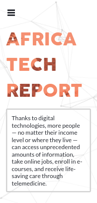

# Capstone Project: Africa Tech Report

> This is the first capstone project from microverse. I chose to make it about an annual tech magazine about the evolution of technology in Africa and all of its impact on people's lives.

## Screenshots

- **Mobile**

- **Laptops/Desktops**

## Built With

- HTML/CSS
- Vanilla JS
- Technologies:
  - Git/Github
  - Fontawesome
  - Material Design

## Live Demo

[Live Demo Link](https://jssol.github.io/africa-tech-report/)

## Intro video

> By watching this short video, you will have a better understanding of our project and mission.

[What is The Africa Tech Report?](https://www.loom.com/share/ac2ae7cd0abc45edb19133912fc43526)

## Getting started

To get a local copy up and running follow these simple example steps.

Clone the repo with `git clone https://github.com/jssol/africa-tech-report.git`

Run `npm install` from the command line

Run `npx hint .` to test for HTML linting check

Run `npx stylelint "**/*.{css,scss}"` to test for css/scss linting check

Run `npx eslint .` to test for javascript linting check

The app is deployed using Github Pages. You can view it by clicking the [Live Demo Link](#Live-Demo) above.

## Author

👤 **Jonathan Sivahera**

- GitHub: [@jssol](https://github.com/jssol)
- Twitter: [@jsivahera](https://twitter.com/jsivahera)
- LinkedIn: [Jonathan Sivahera](https://linkedin.com/in/jsivahera)

## 🤝 Contributing

Contributions, issues, and feature requests are welcome!

Feel free to check the [issues page](../../issues/).

## Acknowledgments

- This website is based off of [Cindy Shin's](https://www.behance.net/adagio07) design on Behance.
- Here's is the link to the [design work](https://www.behance.net/gallery/29845175/CC-Global-Summit-2015).
- This work is under the CC Commons license 4.0

## Show your support

Give a ⭐️ if you like this project!

## 📝 License

This project is [MIT](./MIT.md) licensed.
